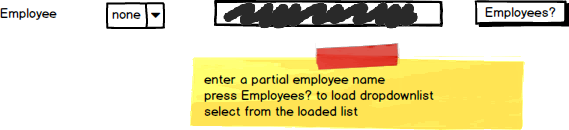

# A02: Clubs

You must do two web form pages (Query and CRUD) based on the following database tables.

## CRUD

> **Clubs** - Single Item Create/Read/Update/Delete

- Clubs is a short list. You can use a dropdownlist to choose the club to maintain.
- Include a not mapped property called FullName when creating the Employee entity definition. This property will return a string containing the LastName, Firstname of the employee.
- Provide an option for "no" Employee overseeing the club.
- Display the EmployeeID and FullName as labels for the Employee information. Use the Search Filter to add or alter this information.
- **Search Filter:**
  - Use employee firstname/lastname filtering for Employee lookup on CRUD to get a **new** EmployeeID.
  - The filter will fill a drop down list from which the new employee will be selected when adding or updating the club. 

## Query

> **Clubs by Active Status** - GridView Lookup with ObjectDataSource controls

- Avoid the use of code-behind in the form wherever possible.
- Allow the user to choose between veiwing active or non active clubs.
- Employee information must be displayed in a drop down list showing FullName on the GridView. This list is to contain only employees associated with clubs.
- Customize your GridView for field size and datatype.

## Recommended Stored Procedures

The following specialty stored procedures are available:

- `Clubs_FindByActiveStatus` - Returns zero or more Clubs matching the supplied active status
- `Employees_ActiveInClubs` - Returns all employees associated with clubs
- `Employees_FindByPartialName` - Returns zero or more employees whos first or last name contains the supplied string
