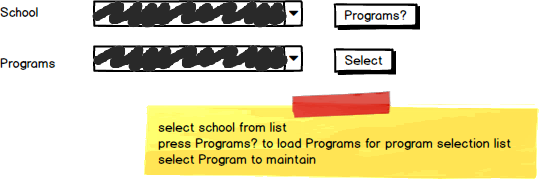

# A03: Programs

You must do two web form pages (Query / CRUD) based on the following database tables.

## CRUD

> **Programs** - Single Item Create/Read/Update/Delete

- **Search Filter:**
- Use Schools for filter lookup of school programs for CRUD for update and delete. 
- The school list can be used to obtain the school when adding or updating the program.

## Query

> **Programs by Program Name** - GridView Lookup with ObjectDataSource controls

- Avoid the use of code-behind in the form wherever possible.
- Allow the user to enter a partial Program Name.
- Display the school using a drop down list on your GridView
- Customize your GridView for field size and datatype.

## Recommended Stored Procedures

The following specialty stored procedures are available:

- `Programs_FindBySchool` - Returns zero or more Programs records matching the supplied school code
- `Programs_FindByProgramName` - Returns zero or more Programs records containing the supplied partial program name.
