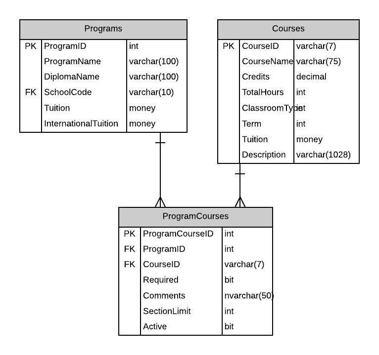

# A04: Program Courses

You must do two web form pages (Query and CRUD) based on the following database tables.

## CRUD

> **ProgramCourses** - Single Item Create/Read/Update/Delete

- Provide a prompt line to ensure the user selects a Course (no default).
- ProgramCourses are not deleted. ProgramCourses are made inactive. Change the `Active` flag of ProgramCourses to indicate its current status.
- Include a not mapped property called CourseNameID when creating the Course entity definition. This property will return a string containing the `CourseName ( CourseID )` of the course.
- **Search Filter:**
  - Use Programs and Course filtering for ProgrmCourse record lookup 

- **Add/Edit Detail Filter:**
  - Use Program list for foreign key: ProgramID
  - Use Course partial name filtering for foreign key: CourseID

## Query

> **ProgramCourses by Program** - Gridview Lookup with ObjectDataSource controls

- Avoid the use of code-behind in the form wherever possible.
- Do not display the `ProgramId` as part of their multiple records display.
- Display the `CourseNameID` for the foreign key to the course using a DropDownList

## Recommended Stored Procedures

The following specialty stored procedures are available:

- `ProgramCourses_FindByProgramAndCourse` - Returns zero or more ProgramCourses records matching the supplied program id and course id
- `ProgramCourses_FindByProgram` - Returns zero or more ProgramCourses records matching the supplied program id
- `Courses_FindByPartialName` - Returns zero or more Courses whos course name includes the supplied string
